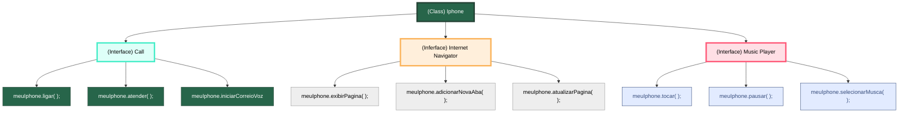

# Projeto-Interface-Iphone
Projeto desenvolvido com interfaces e heranca.

```mermaid
flowchart TD
    F["(Class) Iphone"] --> n2["(Interface) Call"] & n3["(Inferface) Internet Navigator"] & n4["(Interface) Music Player"]
    n2 --> n5["meuIphone.ligar( );"] & n6["meuIphone.atender( );"] & n7["meuIphone.iniciarCorreioVoz"]
    n3 --> n8["meuIphone.exibirPagina( );"] & n9["meuIphone.adicionarNovaAba( );"] & n10["meuIphone.atualizarPagina( );"]
    n4 --> n11["meuIphone.tocar( );"] & n12["meuIphone.pausar( );"] & n13["meuIphone.selecionarMusca( );"]

    n2@{ shape: rect}
     F:::Pine
     n2:::Aqua
     n3:::Aqua
     n3:::Peach
     n4:::Aqua
     n4:::Rose
     n5:::Pine
     n6:::Pine
     n7:::Pine
     n8:::Pine
     n8:::Ash
     n9:::Ash
     n10:::Ash
     n11:::Sky
     n12:::Sky
     n13:::Sky
    classDef Aqua stroke-width:1px, stroke-dasharray:none, stroke:#46EDC8, fill:#DEFFF8, color:#378E7A
    classDef Pine stroke-width:1px, stroke-dasharray:none, stroke:#254336, fill:#27654A, color:#FFFFFF
    classDef Peach stroke-width:1px, stroke-dasharray:none, stroke:#FBB35A, fill:#FFEFDB, color:#8F632D
    classDef Ash stroke-width:1px, stroke-dasharray:none, stroke:#999999, fill:#EEEEEE, color:#000000
    classDef Rose stroke-width:1px, stroke-dasharray:none, stroke:#FF5978, fill:#FFDFE5, color:#8E2236
    classDef Sky stroke-width:1px, stroke-dasharray:none, stroke:#374D7C, fill:#E2EBFF, color:#374D7C
    style F stroke-width:4px,stroke-dasharray: 0
    style n2 stroke-width:4px,stroke-dasharray: 0,color:#000000
    style n3 stroke-width:4px,stroke-dasharray: 0,color:#000000
    style n4 stroke-width:4px,stroke-dasharray: 0,color:#000000


```
